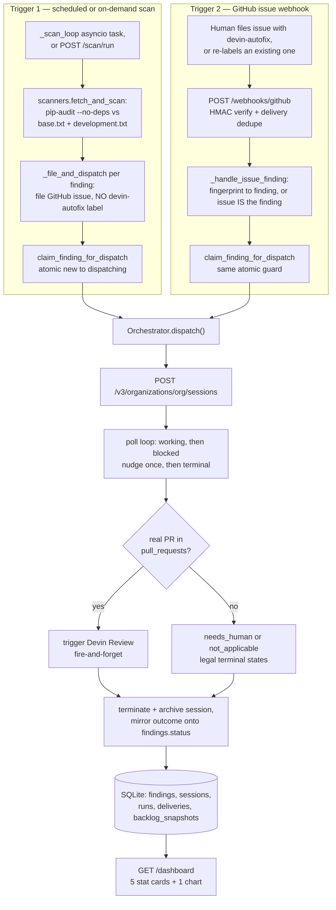

# Devin Remediation Pipeline

A live orchestrator that dispatches real [Devin](https://devin.ai) sessions against real, organic CVEs and real, human-reported bugs in [`neerajsa/superset`](https://github.com/neerajsa/superset), a fork of Apache Superset. Not a prototype: every artifact linked below is a real GitHub issue, PR, or Devin session that this system produced by running against a live target repository, not a staged one.

## Table of contents

- [Problem framing](#problem-framing)
- [Quickstart](#quickstart)
- [Demo and evidence](#demo-and-evidence)
- [Artifacts from neerajsa/superset](#artifacts-from-neerajsasuperset)
- [Architecture and repository structure](#architecture-and-repository-structure)
- [Key design decisions](#key-design-decisions)
- [Tech stack](#tech-stack)
- [Metrics and dashboard](#metrics-and-dashboard)
- [Known gaps and non-goals](#known-gaps-and-non-goals)

---

## Problem framing

Apache Superset pins 400+ Python dependencies. At any given moment a scanner will surface a handful of live CVEs against that pin set. Scanning that is solved — `pip-audit` runs in a couple of seconds and costs nothing. **Remediation is not solved.**

The gap is specific, and it's where security debt actually accumulates: automated dependency bots (Dependabot, Renovate) raise the version-bump PR, but a meaningful fraction of those bumps are breaking changes. The bot can't read the upstream changelog, find the affected call sites, adapt them, and run the test suite. So the PR lands red and sits in the queue until an engineer has a free afternoon. At an org running at Superset's scale — hundreds of pinned packages, a real test suite, a real breaking-change surface — median time-to-remediate is measured in weeks, not because nobody knows about the CVE, but because the fix is a small, unglamorous, judgment-requiring engineering task that always loses the priority argument against feature work.

That's the whole thesis: **the work is bounded, well-specified, and requires judgment.** That is precisely the shape of task an autonomous coding agent is good at — and precisely the shape of task a `sed` script or a bot is not.

This system was built against three explicit evaluation axes, and each one constrained the build in a specific way:

| Axis | Constraint this imposed |
|---|---|
| Translate ambiguous problems into working systems | The use case has to be one a real, Superset-scale org pays people to do, evaluated against a stated human baseline — not a synthetic toy problem. |
| Leverage Devin as a core primitive, not just a helper tool | **Zero remediation logic in this code.** The orchestrator dispatches, polls, verifies, and records. Every judgment call — which version, which call sites, whether to fix at all — belongs to Devin. If a `sed` script could do it, it doesn't belong in the demo. |
| Communicate technical execution and business impact | The metrics layer is a first-class deliverable, not instrumentation bolted on afterward. Every number on the dashboard is computed from real session data, and every broken or unavailable number is labeled as such rather than hidden. |

Two more constraints layered on top, self-imposed:

- **Operational realism.** Webhook redelivery, blocked sessions, timeouts, and race conditions between trigger paths are all handled explicitly, because a demo that only works on the happy path reads as junior.
- **Honest observability.** Failures are reported as prominently as successes. A dashboard showing 100% success is less credible than one showing a real `needs_human` refusal sitting next to six real PRs.

---

## Quickstart

There is no mock mode and no keyless path — this is a deliberate decision (`src/config.py` raises `ConfigError` unconditionally if any required credential is missing). Real credentials for Devin and GitHub are required to run this at all.

```bash
git clone https://github.com/neerajsa/devin-solution.git
cd devin-solution
cp .env.example .env
# fill in WEBHOOK_SECRET, DEVIN_API_KEY, DEVIN_ORG_ID, GITHUB_TOKEN
# GITHUB_REPO already defaults to neerajsa/superset

make up
```

`make up` runs `docker compose up --build` — one service (`orchestrator`), one port (`8000`), one bind-mounted volume (`./data:/app/data`, so the SQLite database survives restarts). Confirm it's alive:

```bash
curl -H "Authorization: Bearer $WEBHOOK_SECRET" http://localhost:8000/healthz
# {"status": "ok"}
```

`/healthz` and `/dashboard` are token-gated (`src/auth.py::require_token`) because `make tunnel` (below) can expose this to the public internet — worth closing off even for an inert liveness probe. Either an `Authorization: Bearer` header or a `?token=` query param works; the dashboard is at `http://localhost:8000/dashboard?token=<WEBHOOK_SECRET>` for a browser tab.

To prove `make up` isn't quietly depending on anything left over in your working tree, run a from-scratch reproducibility check:

```bash
make verify-clean
```

This clones the repo fresh into `/tmp/devin-solution-verify-clean`, copies in your real `.env`, does a `--no-cache` build, and curls `/healthz`.

The full Make target list, exactly as it exists in the real `Makefile`:

| Target | What it does |
|---|---|
| `make up` | `docker compose up --build` |
| `make test` | `python -m pytest tests/` |
| `make tunnel` | `cloudflared tunnel --url http://localhost:8000` — fronts the local container for real webhook delivery |
| `make demo-issue` | Files a real GitHub issue on `GITHUB_REPO` with the `devin-autofix` label, reproducing the exact datetime bug this system already fixed for real (see below), for a repeatable live walkthrough |
| `make demo-scan` | `POST /scan/run-demo` — a fast, low-cost, single-CVE scan path, isolated from the production scan (see below) |
| `make verify-clean` | Fresh clone, `--no-cache` build, healthcheck |

`demo-issue` and `demo-scan` are recent additions (`src/main.py`'s `/scan/run-demo` route and `scripts/demo_issue_body.md`), built specifically so a live walkthrough doesn't have to wait on a full multi-package scan or an already-consumed one-off bug report. `demo-scan` deliberately scans only `requirements/base.txt` first (skipping `development.txt` unless it has to — see below) and dispatches exactly one finding: **whichever one `pip-audit` returns first that's still actually dispatchable**, not a named package. That's deliberate: a fresh fork of *current, real* `apache/superset` is a moving target — a hardcoded package name could already be patched upstream, or gone entirely, by the time someone runs this. If `base.txt` comes back with zero findings that day, it falls back to scanning `development.txt` once. It shares no code path with the production `_scan_and_file` beyond the same `_file_and_dispatch` function every trigger ultimately calls, so nothing about "demo mode" can leak into what a real scan does.

---

## Demo and evidence

A real dependency-CVE remediation takes anywhere from 3 to 90+ minutes — too long to wait on for a first look. There are two ways to verify this system actually works, and neither requires sitting through a live session end to end.

### Option 1 — read the evidence (zero cost, zero setup)

Every link in the [artifacts table](#artifacts-from-neerajsasuperset) below is real: a real GitHub issue, a real PR, a real Devin session, produced by this exact system running against a live target repo. Click through a few. Nothing there is staged or reproducible-on-demand theater — it already happened.

### Option 2 — trigger it yourself (needs your own Devin + GitHub credentials)

Both commands dispatch a real Devin session and cost real money against your own account — they're not simulations. Run `make up` first, then:

```bash
make demo-issue   # files a real GitHub issue (the datetime-filter bug), labeled devin-autofix
make demo-scan    # POST /scan/run-demo — scans requirements/base.txt for real, dispatches one real CVE
```

**Prerequisite for `demo-issue`**: the `devin-autofix` label must already exist on your target repo (same requirement as the production webhook path — GitHub doesn't auto-create labels via the API's `--label` flag if they're missing). Create it once: `gh label create devin-autofix --repo <your-fork> --color 1D76DB --description "Findings for the Devin remediation pipeline to dispatch"`.

**What each one demonstrates**, and why they needed to be built separately from the production paths rather than just reusing them directly:

- `demo-issue` reuses the *exact* text of the real bug report that produced [issue #4 / PR #5](#artifacts-from-neerajsasuperset) — filing it fresh gets a new issue number (and therefore a new fingerprint, `github-issue-{n}`), so it dispatches as a genuinely new session regardless of what's already on your fork. No code change was needed for this path at all; filing an issue with the label *is* the trigger, exactly as the production webhook path already works.
- `demo-scan` exists because a full production scan can surface several CVEs at once (`requirements/base.txt` alone has 4 on a typical Superset checkout) — fine for production, not for a fast, low-cost live demo. It scans only `base.txt` and dispatches exactly one finding: **whichever one `pip-audit` returns first that's still dispatchable**, not a hardcoded package name. That's deliberate — a fresh fork of *current* `apache/superset` is a moving target, so pinning the demo to a specific CVE risked it already being patched upstream by the time someone ran this. See [`/scan/run-demo`](#quickstart) above for the exact mechanism; it shares no code path with the production scan beyond the same `_file_and_dispatch` function every trigger ultimately calls.

**Watching it work**: `POST /scan/run-demo` and `make demo-issue` both return immediately (`{"status": "accepted", "run_id": "..."}`) — the actual Devin session runs in the background. Watch it progress three ways: the real Devin session URL (logged by the orchestrator, and visible directly at `app.devin.ai` under your org), the target repo's Issues/PRs tab, or `GET /dashboard` on your own running instance, which updates live as the session progresses through `working` → a terminal outcome.

**A genuinely possible outcome worth naming up front**: `demo-scan`'s target CVE, or `demo-issue`'s underlying bug, might already be fixed on whatever fork you run this against — pip-audit reporting zero findings, or Devin correctly determining `not_applicable`. That's not a broken demo; it's the same honest evidence-based behavior demonstrated throughout this system (see [paramiko](#artifacts-from-neerajsasuperset) and [jaraco-context](#artifacts-from-neerajsasuperset) above, both genuine non-fabricated refusals). A system that can't say "nothing to do here" convincingly isn't one you can trust to say "I fixed it" convincingly either.

---

## Artifacts from neerajsa/superset

Everything below is real, pulled live from `gh issue list` / `gh pr list` against `neerajsa/superset`, not curated from memory. Nothing here is staged — every PR traces back to an issue this system filed or received, and every outcome, including the two refusals, is the actual outcome Devin reported.

### Dependency-CVE findings (scanner-direct dispatch, no webhook)

| Issue | Package | PR | Outcome | What Devin actually did |
|---|---|---|---|---|
| [#2](https://github.com/neerajsa/superset/issues/2) | `setuptools` 80.9.0 | — | **`not_applicable`** | Investigated CVE-2026-59890 (a Unicode-normalization bug in `setuptools`' sdist-packaging `FileList`) and correctly determined it doesn't apply: the vulnerable path only runs during sdist builds, Superset's own `pyproject.toml` resolves its build-time setuptools independently of the pinned requirement, and the fork has zero non-ASCII tracked filenames — the exploit precondition doesn't exist. Also flagged that bumping past 81.x would break `pkg_resources` consumers (`sqlalchemy-redshift`) for no real security gain. No PR opened. |
| [#11](https://github.com/neerajsa/superset/issues/11) | `paramiko` 3.5.1 | — | **`needs_human`** | The strongest judgment case in the set. Determined the code path *is* reachable (`superset/extensions/ssh.py`, the SSH-tunnel database feature) and that a fix *does* exist (5.0.0 — pip-audit's own scan data said "none published," Devin caught the discrepancy). But paramiko 4.0+ removes `DSSKey`, and `sshtunnel==0.4.0` (unmaintained since 2021) references it on an unconditional code path — reproduced the exact `AttributeError` in a clean venv. Bumping would break every SSH-tunneled DB connection Superset supports. Explained several partial mitigations (`disabled_algorithms`) and explicitly declined to force a broken upgrade. Correctly refused. |
| [#4](https://github.com/neerajsa/superset/issues/4) | — (`reported-issue` class) | [#5](https://github.com/neerajsa/superset/pull/5) | **`remediated`** | Root-caused a real bug in `get_since_until`'s "previous calendar quarter" date math: `parse_human_datetime` mixed two clocks — `dateutil`'s default anchored on `datetime.now()`, but its `parsedatetime` fallback (the path that actually resolves `"today"`) was called without a `sourceTime` and silently anchored on `time.localtime()` instead. When the two clocks disagree about the calendar day near a timezone/year boundary, the quarter math shifts by a full quarter. Filed as a hand-written human bug report (not a scanner finding), fixed with a regression test. |
| [#6](https://github.com/neerajsa/superset/issues/6) | `pytest` 7.4.4 | [#7](https://github.com/neerajsa/superset/pull/7) | **`remediated`** | The standout dependency-CVE case. CVE-2025-71176 required jumping two major versions (7.4.4 → 9.0.3, skipping the entire 8.x line). That forced a coordinated bump of three pinned plugins (`pytest-asyncio` 0.23.8 → 1.3.0, `pytest-cov`, `pytest-mock`) to keep the lockfile installable, plus a real code fix: `tests/unit_tests/conftest.py` imported `SubRequest` from the private `_pytest.fixtures` module, which moves across major versions — fixed to the public alias. Multi-file, coordinated breaking-change repair, not a mechanical bump. |
| [#8](https://github.com/neerajsa/superset/issues/8) | `cryptography` 49.0.0 | [#9](https://github.com/neerajsa/superset/pull/9) | **`remediated`** | CVE-2026-69247, a Bleichenbacher-oracle timing leak in PKCS#7 decryption. Confirmed Superset's own code never calls the vulnerable APIs directly, but the pin is still shipped, so raised it to 50.0.0. No breaking changes in the target version's changelog. |
| [#10](https://github.com/neerajsa/superset/issues/10) | `flask` 2.3.3 | [#14](https://github.com/neerajsa/superset/pull/14) | **`remediated`** | The multi-file coordinated case. Flask 3.x removes `_app_ctx_stack`, which `flask-sqlalchemy==2.5.1` imports in four places — a hard break at import time. Bumping flask to 3.1.3 forced a coordinated `flask-sqlalchemy` (→3.0.5) and `flask-babel` (→4.0.0, itself importing a removed `flask.helpers.locked_cached_property`) bump, cascading through real call sites, not just a re-pin. |
| [#13](https://github.com/neerajsa/superset/issues/13) | `mcp` 1.24.0 | [#15](https://github.com/neerajsa/superset/pull/15) | **`remediated`** | Three CVEs, one of which (CVE-2026-52870, a session-hijacking auth bypass in the SSE/Streamable-HTTP transport) Devin confirmed actually reaches Superset's own `superset/mcp_service/server.py`. Bumped to 1.28.1, the minimum version fixing all three. |
| [#16](https://github.com/neerajsa/superset/issues/16) | `pip` 25.1.1 | [#17](https://github.com/neerajsa/superset/pull/17) | **`remediated`** | Five CVEs (symlink traversal on tar extraction, wheel path traversal, entry-point path injection, tar/zip polyglot confusion, an update-check ordering bug). Confirmed `pip` is imported at runtime by `shillelagh`'s gsheets engine spec, not just a build-time tool. Bumped to 26.1.2. |
| [#18](https://github.com/neerajsa/superset/issues/18) | `python-multipart` 0.0.29 | [#19](https://github.com/neerajsa/superset/pull/19) | **`remediated`** | Three CVEs including a WHATWG-URL-vs-`urllib.parse` parser differential that could smuggle form fields past a compliant intermediary. Confirmed as transitive-only (pulled in via `mcp`/`fastmcp-slim`, no direct import in Superset's own code) and bumped to 0.0.31 anyway, since the pin is still shipped. |
| [#12](https://github.com/neerajsa/superset/issues/12) | `jaraco-context` 6.0.1 | — | **`not_applicable`** | A Zip Slip path-traversal bug in `jaraco.context.tarball()` — but traced the actual dependency chain (`jaraco-context` ← `keyring` ← `py-key-value-aio`, dev-only, never in `base.txt`) and confirmed by inspecting the real `keyring` wheel that its only usage imports `ExceptionTrap`/`suppress`, never `tarball()` — the vulnerable function is never reachable from anything Superset actually runs. Correctly declined to bump for no real security gain, and explicitly flagged the residual-risk condition under which that would change. No PR opened. |

### Proof-of-push (Phase 1, before any orchestrator code existed)

- [PR #1](https://github.com/neerajsa/superset/pull/1) — a trivial docstring typo fix (`superset/utils/oauth2.py`), the very first thing Devin ever pushed to the fork, run manually via curl before any orchestrator code was written. Kept here rather than deleted because it's real evidence that Devin could write to the fork at all — the load-bearing gate the rest of the project depended on.

### A non-artifact worth naming

- [Issue #3](https://github.com/neerajsa/superset/issues/3) (closed) — a real webhook-delivery test during Phase 4, used to confirm `issues.opened`/`labeled`/`unlabeled` all deliver distinct, correctly-signed events. Not a finding; listed so the issue numbering above isn't mysterious.

---

## Architecture and repository structure

### Two structurally independent trigger paths

The system has two ways a finding gets dispatched, and they never share a code path until `Orchestrator.dispatch()`:

1. **Scheduled/on-demand scan** (`main.py::_scan_loop`, an in-process `asyncio` background task, or `POST /scan/run` for an immediate trigger) — runs `pip-audit --no-deps` against `requirements/base.txt` and `requirements/development.txt`, fetched over plain HTTP with no repo clone. For each finding, `_file_and_dispatch` files a GitHub issue (audit trail only) and calls `Orchestrator.dispatch()` **directly, in-process** — no webhook round-trip, no dependency on the tunnel being up.
2. **GitHub issue webhook** (`POST /webhooks/github`) — fires when a human files an issue with the `devin-autofix` label, or manually re-labels an existing one. HMAC-verified, deduped on `X-GitHub-Delivery`, then routed through `_handle_issue_finding`, which either resolves a fingerprint marker back to a scanner-originated finding or — if there's no marker — treats the issue itself as the finding (`finding_class="reported-issue"`). This is how the datetime bug (issue #4, PR #5) entered the system.

**Why `devin-autofix` is reserved exclusively for the webhook path.** Filing a scanner-originated issue *with* that label races the direct in-process dispatch against itself on every single scan, not occasionally: GitHub always fires `issues.opened`, and if the label is present at creation, the webhook trigger fires too, for the exact same finding the direct call is already handling. The fix is structural, not a race guard bolted on top: scanner-filed issues never carry the label (`file_issue(..., labels=[])`), so the two trigger mechanisms are non-overlapping by construction. A human can still manually apply the label later to force a re-check through the webhook path — `store.claim_finding_for_dispatch`'s atomic guard protects that case too.



### The evidence rule

`orchestrator.py::resolve()` is the single most load-bearing function in the system. Devin populates `structured_output` progressively, *while the session is still running* — a session can claim `"status": "remediated"` before any PR exists. Separately, a session's own `status` frequently never reaches a terminal value (`exit`/`error`) even after all real work is done; two real sessions (a throwaway and the real PR-#5 session) sat in `running`/`waiting_for_user` indefinitely. So completion is evidence-based, not status-based:

```python
def resolve(session: dict) -> tuple[str, str | None]:
    status = session.get("status")
    detail = session.get("status_detail")
    out = session.get("structured_output") or {}
    prs = session.get("pull_requests") or []
    pr = prs[0]["pr_url"] if prs else None
    claim = out.get("status")

    if claim in NO_PR_NEEDED_CLAIMS:        # not_applicable, needs_human
        return claim, pr
    if claim in PR_BACKED_CLAIMS and pr:    # remediated, partially_remediated
        return claim, pr

    if status == "suspended":
        return "blocked", pr
    if status == "running" and detail in BLOCKED_DETAILS:
        return "blocked", pr
    if status in TERMINAL_SESSION_STATUS:
        return ("no_pr" if not pr else "remediated"), pr
    return "working", pr
```

`not_applicable` and `needs_human` are legal *successful* terminal states — a claim requires no PR to back it, because the evidence for those outcomes is the reasoning itself. `remediated`/`partially_remediated` require a real `pull_requests[]` entry; a bare claim is never trusted.

### Issue-as-pointer

For scanner-originated findings, the GitHub issue is never the source of truth — it's a pointer. The finding lives in SQLite (`findings` table), keyed by a stable fingerprint (`{vuln_ids}:{package}`, lowercased); the issue body just carries an HTML-comment marker (`<!-- devin-autofix:fingerprint=... -->`) that `github_client.py::extract_fingerprint` reads back. Re-scanning is idempotent because `insert_finding` returns the existing row on a fingerprint match rather than duplicating it. For `reported-issue`-class findings (human bug reports), there's no marker to write — the issue number itself (`github-issue-{n}`) is the fingerprint, since it's already unique.

### Repository structure

The actual tracked file tree (`git ls-files`), not the aspirational one from an early design pass:

```
devin-solution/
├── .env.example              # WEBHOOK_SECRET, DEVIN_API_KEY, DEVIN_ORG_ID, GITHUB_TOKEN, GITHUB_REPO
├── .dockerignore / .gitignore
├── Dockerfile                 # python:3.11-slim, single stage, token-gated HEALTHCHECK
├── docker-compose.yml         # one service, one port, ./data volume
├── Makefile                   # up / test / tunnel / demo-issue / demo-scan / verify-clean
├── pytest.ini
├── requirements.txt
├── src/
│   ├── main.py                # FastAPI app: /healthz, /scan/run, /scan/run-demo, /webhooks/github, scan scheduler
│   ├── auth.py                 # shared bearer/query-param token check for /healthz + /dashboard
│   ├── config.py                # env-var loading, fails fast if any credential is missing
│   ├── devin.py                # thin async Devin v3 API client
│   ├── github_client.py        # issues, comments, labels, fingerprint marker, (unused) CI check-run helpers
│   ├── orchestrator.py         # dispatch, evidence-based resolve(), poll loop, semaphore
│   ├── scanners.py              # pip-audit → Finding, fan-out-safe grouping, fetch_and_scan
│   ├── prompts.py               # structured_output schema + per-finding-class prompt renderers
│   ├── store.py                 # SQLite: findings / sessions / runs / deliveries / backlog_snapshots
│   ├── metrics.py               # the six metrics
│   ├── dashboard.py             # dashboard route + hand-rolled inline SVG burndown chart
│   └── templates/dashboard.html # the one Jinja2 template
├── scripts/
│   └── demo_issue_body.md      # body text for `make demo-issue`
└── tests/
    ├── fixtures/pip_audit_sample.json
    └── test_{config,dashboard,devin,github_client,main,metrics,orchestrator,prompts,scanners,store}.py
```

---

## Key design decisions

**Evidence-based completion, not status-based.** Covered above under [the evidence rule](#architecture-and-repository-structure) — worth repeating here because it's the decision every other one in this section either supports or was caused by.

**CI verification: built, dispatched once, retired the same day.** The system originally kept a PR-backed session open and waited for its checks to go green, retrying a failure back into the same session. It worked exactly once — dispatching the real datetime fix (issue #4) — and then broke: GitHub Actions was never actually enabled on the fork (forks ship with Actions disabled by default; nobody had clicked consent), so `wait_for_checks` timed out with zero checks having ever run, and the retry logic didn't distinguish "timeout" from "failure" — it sent Devin a hardcoded *"CI failed on your PR"* message with an empty log, telling it to fix something that was never broken. Caught live before Devin acted on it. The fix wasn't a longer timeout (the real workflow plausibly needs 30–40+ minutes even when it works, given a 30-minute job budget, a separate sequential gate, no test caching, and coverage instrumentation) — it was retiring CI verification entirely. A real PR is now the sole completion signal, `orchestrator.dispatch()` terminates the session immediately once one exists, and triggers a real Devin Review (`POST /v3/organizations/{org}/pr-reviews`) fire-and-forget as the human reviewer's second opinion instead. `github_client.py`'s `wait_for_checks`/`failing_job_log` are still there, independently tested, but nothing calls them.

**The duplicate-dispatch bug and the atomic claim.** GitHub fires *two* separate events for one "create an issue with a label already attached" action — `issues.opened` (with the label already in the payload) and a separate `issues.labeled` — a real, observed case, not a hypothetical. Both events independently reaching the dispatch logic started two Devin sessions for the same finding. The fix is `store.claim_finding_for_dispatch`, an atomic `UPDATE ... WHERE status = 'new'` whose `rowcount` tells the caller whether *it* won the race; only the winner dispatches. It protects both trigger paths — the webhook race described above, and a second, structurally different race between two overlapping scan runs (a manual `/scan/run` firing while the scheduled loop also fires).

**The fan-out fix: one `Finding` per package, not per CVE.** `pip-audit` can and does return several distinct CVEs against the same `(package, version)` — `pip` alone had 5 rows in `requirements/development.txt`, `mcp` and `python-multipart` had 3 each. Deduping on `(package, version, vuln_id)` alone dispatches 5 independent Devin sessions against `pip`, each bumping the identical pin for a different CVE and racing to open conflicting PRs. `scanners.py::parse_pip_audit` groups by `(package, version)` first, and `_finding_for_group` combines the CVE list, takes the *maximum* of each vuln's own minimum fix version (`packaging.version.Version` comparison — the reason `packaging` is a real dependency here, not decorative), and produces one `Finding`. A single-CVE package still gets the original fingerprint format unchanged, so already-issued findings kept matching their real GitHub issue markers when this shipped.

**Zero remediation logic — Devin communicates its own outcomes.** Once a session reaches a terminal outcome, something has to explain it to the human who'll actually read the issue. Having this system's own code template a comment from the already-validated `structured_output` would be the more deterministic option, but deciding *how to explain an outcome* is a judgment call, and judgment calls belong to Devin, not a template, under this system's own founding constraint: zero remediation logic in the orchestrator's code. Instead, `prompts.py::communicate_result_block()` instructs Devin to post the comment itself as its own last task step, appended verbatim to every prompt. The real setuptools `not_applicable` comment (quoted in the artifacts table above) is the direct result — a genuinely well-reasoned, multi-part explanation this code never interpreted or summarized.

**The poll-resilience fix: an unconfigured `httpx` timeout orphaning a healthy session.** Dispatching `flask` during a real scan, `_poll_to_terminal`'s `get_session` call hit a one-off `httpx.ReadTimeout`. The loop treated it as fatal and moved on to the next finding — flask's real session kept working and finished normally (a real PR, `remediated`) but sat unwatched for hours until manually reconciled. Root cause: `devin.py`'s `DevinClient` never set an explicit `timeout=`, so httpx's aggressive 5-second default applied to polling a busy agentic session. Fixed at the source: `REQUEST_TIMEOUT_SECONDS = 30.0`, set explicitly. A capped retry count (e.g. giving up after 5 consecutive failures) was considered and deliberately not used — an arbitrary number like that can reproduce the exact same incident after a longer delay against a genuinely sustained outage, which is no fix at all. Instead `httpx.TransportError` is retried with **no cap at all** in `_poll_to_terminal` — on the same footing as the existing "still working" branch of the same loop, because a transient network error carries exactly as much information about the session's real state as "still working" does: none. A real, informative failure (`DevinAPIError` — 401/404/500) still propagates immediately.

---

## Tech stack

- **FastAPI** 0.115.6 + **uvicorn** — the whole app is one process, one port.
- **httpx** 0.28.1 — both API clients (`devin.py`, `github_client.py`); `AsyncClient` for the app, a sync `Client` inside `scanners.py`'s subprocess-scoped OSV severity lookups.
- **SQLite**, no ORM — `store.py` owns five tables: `findings` (fingerprint-unique, one row per remediation target), `sessions` (one row per Devin session, `structured_output` stored as JSON text), `runs` (one row per scan or dispatch batch), `deliveries` (webhook dedupe by `X-GitHub-Delivery`), `backlog_snapshots` (append-only, written on every status transition — the data behind the burndown chart).
- **Jinja2** 3.1.5 — one hand-rolled template (`src/templates/dashboard.html`), no HTMX, no frontend JS framework. Deliberate minimalism: a dashboard read by a VP once a week doesn't need a build step.
- **pip-audit** 2.10.1 — the only scanner in the MVP; always invoked as `sys.executable -m pip_audit`, never a bare PATH lookup (a bare invocation was confirmed live to silently resolve to a different Python install and hit an unrelated 3.14 dependency-resolution failure).
- **packaging** 26.3 — added specifically for the fan-out fix's semver comparison (`Version` objects, so "the max of several minimum fix versions" is computed correctly rather than by string comparison).
- **Docker / docker-compose** — `python:3.11-slim` base (matching Superset's own `>=3.11` floor and CI, not cosmetic — `pip-audit` hard-fails resolving some pins under 3.14), plus `pkg-config`/`default-libmysqlclient-dev` for `mysqlclient`'s build metadata (needed even with `--no-deps`, since pip-audit's own internal dry-run install still resolves top-level build requirements).
- **Devin API v3** — session creation/polling/messaging, PR reviews, session termination. `devin.py` implements nothing beyond what's been directly confirmed against the real API.
- **GitHub REST API** — issues, comments, labels, webhook HMAC verification.
- **pytest** 8.3.4 + **pytest-asyncio** 0.25.2 — ten test modules covering every `src/` module.

One honest inconsistency worth naming: **`prometheus-client` (0.21.1) is listed in `requirements.txt` but never imported anywhere in `src/`.** No `/metrics` endpoint was ever built (the dashboard is Jinja2-rendered HTML, not Prometheus text format) — this is a leftover from an earlier design pass that should be pruned, not a hidden feature.

---

## Metrics and dashboard

*"A VP reads six numbers, not twenty."* `metrics.py::all_metrics()` renders five stat cards plus one chart on `/dashboard` — the discipline held even as two of the original six metrics turned out to be structurally broken.

- **Autonomy rate** — % of successful sessions (`remediated`/`partially_remediated`/`not_applicable`) with `human_messages_sent == 0`. The number that actually speaks to whether this can run unattended.
- **PR-open rate** — replaces `first_pass_ci_rate`, which is permanently `"n/a"`: CI verification was retired the same day it was built (see above), so there are no CI-verified states left to measure. `pr_open_rate` reuses the already-tracked `pr_url` column with zero new instrumentation — % of terminal sessions that produced a real PR.
- **Latency (p50 / p95)**, plus an estimated human-hours-saved figure against an **explicitly labeled assumed baseline** (`HUMAN_BASELINE_MINUTES_BY_CLASS`, 45 min for a dependency-CVE triage, 90 min for a from-scratch bug diagnosis) — a stated, editable assumption rather than a measured fact, so the dashboard carries the caveat *"ASSUMED baseline, not measured"* directly under the figure, not buried in a footnote.
- **Estimated cost per merged fix** — replaces the ACU-based `cost_per_merged_fix`, whose numerator (`acus_consumed`) reads `0.0` on every real session regardless of actual cost: this Devin account is self-serve, not enterprise, and self-serve accounts bill in dollars via on-demand credits — ACUs are legacy pricing not surfaced anywhere in the documented v3 API for this tier. Checked and ruled out: the session object, the session-insights endpoint, the org-level `consumption/daily` endpoint, and the Enterprise-only `consumption/daily/sessions/{id}`. The replacement is a duration-plus-signal heuristic (`RATE_PER_MINUTE * duration * message_factor * scope_factor`), calibrated against the one real, known data point — a genuine $6.14 charge visible in Devin's billing UI for the datetime-fix session — and every rendering of it carries the caption *"heuristic estimate, not real billing data"* unconditionally, never hidden behind a toggle.
- **Failure taxonomy** — counts of `blocked`, `no_pr`, `needs_human`. Tracked and shown, not curated away; a `needs_human` on the dashboard (paramiko) is treated as an asset, not an embarrassment.
- **Backlog burndown** *(the chart)* — a real time series now, not a point-in-time snapshot: `store.py::record_backlog_snapshot` appends a `GROUP BY status` row to `backlog_snapshots` on every status transition (no separate polling scheduler), and `dashboard.py::_render_backlog_chart_svg` draws it as a hand-rolled inline SVG polyline per status — no charting library, consistent with the rest of the project's minimalism.

Every metric is computed from `structured_output`, `status`/`status_detail`, `pull_requests[].pr_url`, and the system's own timestamps — never parsed from prose.

---

## Known gaps and non-goals

**Explicit non-goals**, stated up front rather than discovered as omissions:

- **No PR auto-merge.** A human is the final gate on every fix, always. Devin opens the PR; a person merges it.
- **No multi-repo fan-out.** The scanner takes a single repo; sharding across a portfolio is a config change, not a design change, and was out of scope for the time budget.
- **Not replacing the scanner with Devin.** `pip-audit` is deterministic, free, and instant — putting an agent on detection would burn real cost to do work a script already does perfectly. Devin's value in this system is judgment, not detection.
- **No production auth story.** A single bearer token (`WEBHOOK_SECRET`) gates the orchestrator's own endpoints. A real deployment needs SSO or mTLS; this is a take-home, not a shipped service.

**Real, currently open gaps**, left in deliberately rather than smoothed over:

- **Dispatch within a single scan run is sequential, not concurrent.** `_scan_and_file`'s `for finding in findings: await _file_and_dispatch(...)` loop awaits each dispatch to a full terminal outcome before starting the next — watching a real scan of 9 packages showed only one session ever `working` at a time (for a stretch, this meant `jaraco-context`, `#12` above, sat queued behind whichever finding was currently dispatching — it has since resolved, but that's exactly what "sequential" costs on a real batch). The `Orchestrator`'s `asyncio.Semaphore(4)` is not dead code system-wide (the webhook path and overlapping `/scan/run` calls already share and are bounded by it), but a *single* scan's own findings never get that treatment. Measured cost on a real batch: 138.1 minutes sequential wall-clock vs. an estimated 71.1 minutes at `max_concurrent=4` — a 1.94x speedup, growing with batch size. Explicitly judged not critical for this MVP's scope and timeline; the fix is mechanical (`asyncio.gather` over the per-finding calls, each still fault-isolated), but it surfaces one real prerequisite first — `store.connect()` opens SQLite with no `PRAGMA journal_mode=WAL` and no explicit busy timeout, fine under today's ~1x write concurrency but untested under 4x.
- **`acus_consumed` is non-functional for this account tier**, confirmed by exhausting every documented v3 endpoint that could plausibly carry cost data (see above). `cost_per_merged_fix` is real, correct code computing a genuinely unavailable input — not fabricated around, just honestly labeled and replaced on the dashboard.
- **`first_pass_ci_rate` is permanently `"n/a"`** — a direct, named consequence of retiring CI verification. Replaced on the dashboard by `pr_open_rate`, but the underlying gap (no automated confirmation that a merged PR's tests actually pass) is real: Devin Review is a materially different guarantee than tests actually executing.
- **Log-level escalation for a sustained transient outage is unresolved.** The uncapped-retry fix for the `httpx.TransportError` case (above) logs every retry at `warning` level uniformly — a real, extended outage would be indistinguishable from routine noise in the logs today. Discussed (escalate to `error` once a failure streak exceeds the existing `blocked_nudge_timeout`) but not built, on the judgment that an MVP with no log-aggregation consumer doesn't yet need a severity tier.
- **The `cloudflared` quick-tunnel URL is ephemeral.** It has no fixed subdomain; if it restarts, the registered GitHub webhook silently stops delivering until manually re-pointed via `gh api ... -X PATCH`. There's no automatic reconciliation.
- **Frontend (`superset-frontend/`, React/TypeScript) is entirely out of scope.** A regression or CVE there would never be caught by anything in this system.
- **Several forward-looking finding classes are designed but not built**: rescuing stuck Dependabot PRs, a scanner-driven naive-datetime class (89 real, organic sites already found via `ruff --select DTZ`), flaky-test detection, mypy-suppression-debt triage, license-risk triage, and post-merge regression detection on `master`. None have touched `main.py`/`orchestrator.py`/`prompts.py`/`scanners.py` — nothing there is live yet.
