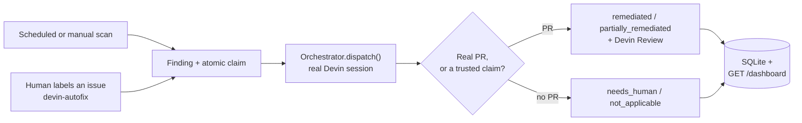
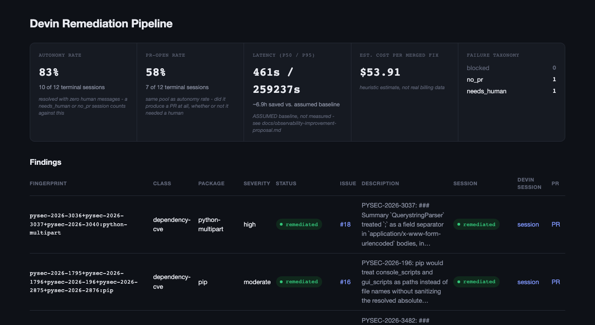

# Devin Remediation Pipeline

A live orchestrator that dispatches real [Devin](https://devin.ai) sessions against real, organic CVEs and real, human-reported bugs in [`neerajsa/superset`](https://github.com/neerajsa/superset), a fork of Apache Superset. Every issue, PR, and session linked below is real, produced by running this system against a live repository, not a staged one.

## Table of contents

- [Problem framing](#problem-framing)
- [Quickstart](#quickstart)
- [Demo and evidence](#demo-and-evidence)
- [Artifacts from neerajsa/superset](#artifacts-from-neerajsasuperset)
- [Architecture and repository structure](#architecture-and-repository-structure)
- [Key design decisions](#key-design-decisions)
- [Tech stack](#tech-stack)
- [Observability](#observability)
- [Known gaps and non-goals](#known-gaps-and-non-goals)

---

## Problem framing

Apache Superset pins 400+ Python dependencies. A scanner finds the CVEs against those pins in seconds, for free. Fixing them is the hard part.

Dependency bots like Dependabot open a version-bump PR, but a real share of those bumps break something. A bot can't read the changelog, find the affected call sites, fix them, and confirm the tests still pass, so the PR sits red until an engineer has a free afternoon. At Superset's scale, real CVEs sit unfixed for weeks, not because nobody knows about them, but because the fix is judgment-heavy engineering work that always loses to feature work.

That's the use case this system targets: bounded, well-specified work that still needs real judgment. That's exactly what an autonomous coding agent is good at, and exactly what a script isn't.

This build was evaluated against three axes, and each shaped a real constraint:

| Axis | What it meant for this build |
|---|---|
| Translate ambiguous problems into working systems | Solve a real problem at Superset's scale, not a synthetic one. |
| Leverage Devin as a core primitive | Zero remediation logic in this code. Every judgment call belongs to Devin. |
| Communicate technical execution and business impact | The dashboard is a first-class deliverable, and every broken metric is labeled, not hidden. |

---

## Quickstart

Real credentials are required. There's no mock mode.

```bash
git clone https://github.com/neerajsa/devin-solution.git
cd devin-solution
cp .env.example .env
# fill in WEBHOOK_SECRET, DEVIN_API_KEY, DEVIN_ORG_ID, GITHUB_TOKEN
# GITHUB_REPO already defaults to neerajsa/superset

make up
```

Confirm it's running:

```bash
curl -H "Authorization: Bearer $WEBHOOK_SECRET" http://localhost:8000/healthz
# {"status": "ok"}
```

**What to put in `WEBHOOK_SECRET`**: any random string, for example `openssl rand -hex 32`. It does two real jobs, not one: GitHub signs webhook payloads with it, so this system can verify a request claiming to be from GitHub actually is one, and it's reused as this system's own bearer token on `/healthz`, `/dashboard`, and the scan endpoints, since `make tunnel` (below) can briefly expose them to the public internet. Both are real security requirements, so this can't be simplified away.

Verify the whole setup works from a completely clean clone:

```bash
make verify-clean
```

### All commands

| Command | What it does |
|---|---|
| `make up` | Start the orchestrator (`docker compose up --build`). |
| `make test` | Run the test suite. |
| `make scan` | Trigger a real production scan of `requirements/base.txt` and `requirements/development.txt`. |
| `make tunnel` | Expose the local instance publicly via `cloudflared`, needed for real GitHub webhook delivery. |
| `make demo-issue` | File a real, `devin-autofix`-labeled GitHub issue for a fast live walkthrough (see [Demo and evidence](#demo-and-evidence)). |
| `make demo-scan` | Trigger a fast, single-CVE scan of `requirements/base.txt` only. |
| `make verify-clean` | Fresh clone, full rebuild, healthcheck. |
| `make dashboard` | Print and open the live dashboard: autonomy rate, PR-open rate, latency, cost estimate, failure taxonomy. |
| `make register-webhook URL=<tunnel-url>` | Register a real GitHub webhook against a running `make tunnel`, enabling the human-reported-bug trigger path. |

To enable the human-reported-bug trigger path: run `make tunnel` in one terminal, copy the URL it prints, then run `make register-webhook URL=<that-url>` in another. Repo, secret, and event type are all pulled from `.env` automatically; the URL is the only piece that can't be, since `cloudflared` assigns a new one every time it starts. From then on, filing or labeling any issue `devin-autofix` dispatches a real session automatically.

---

## Demo and evidence

A real dependency-CVE remediation takes 3 to 90+ minutes, too long to wait on for a first look. There are two ways to verify this system works.

**Option 1: read the evidence.** Every link in the [artifacts table](#artifacts-from-neerajsasuperset) below is real: a real issue, a real PR, a real Devin session. Click through a few.

**Option 2: trigger it yourself.** Both commands dispatch a real Devin session and cost real money on your own account.

```bash
make demo-issue   # files a real GitHub issue (the datetime bug), labeled devin-autofix
make demo-scan    # scans requirements/base.txt for real, dispatches one real CVE
```

`demo-issue` needs the `devin-autofix` label to exist on your target repo first: `gh label create devin-autofix --repo <your-fork> --color 1D76DB --description "Findings for the Devin remediation pipeline to dispatch"`.

`demo-scan` dispatches whichever CVE `pip-audit` finds first that's still open, not a hardcoded package. A fresh fork of current Superset is a moving target, so pinning the demo to one specific CVE risked it already being patched upstream.

Both return immediately (`{"status": "accepted"}`) while the real session runs in the background. Watch progress via the Devin session URL (logged by the orchestrator), the target repo's Issues/PRs tab, or `GET /dashboard`.

---

## Artifacts from neerajsa/superset

Everything below is real, pulled live from `gh issue list` / `gh pr list` against `neerajsa/superset`, not curated from memory.

### Dependency-CVE findings (scanner-direct dispatch, no webhook)

| Issue | Package | PR | Outcome | What Devin actually did |
|---|---|---|---|---|
| [#2](https://github.com/neerajsa/superset/issues/2) | `setuptools` 80.9.0 | - | **`not_applicable`** | Investigated CVE-2026-59890 (a Unicode-normalization bug in `setuptools`' sdist-packaging `FileList`) and correctly determined it doesn't apply: the vulnerable path only runs during sdist builds, and the fork has no non-ASCII tracked filenames, so the exploit precondition doesn't exist. Also flagged that bumping past 81.x would break `pkg_resources` consumers for no security gain. No PR opened. |
| [#11](https://github.com/neerajsa/superset/issues/11) | `paramiko` 3.5.1 | - | **`needs_human`** | The strongest judgment case in the set. Confirmed the code path is reachable (`superset/extensions/ssh.py`), found a fix exists (5.0.0, when pip-audit's own data said none was published), but also found that paramiko 4.0+ removes `DSSKey`, which the unmaintained `sshtunnel==0.4.0` still references unconditionally, reproducing the exact break in a clean venv. Explained partial mitigations and declined to force a broken upgrade. |
| [#4](https://github.com/neerajsa/superset/issues/4) | reported-issue | [#5](https://github.com/neerajsa/superset/pull/5) | **`remediated`** | Root-caused a real bug in `get_since_until`'s "previous calendar quarter" date math: `parse_human_datetime` mixed two clocks, and near a timezone or year boundary the quarter math could shift by a full quarter. Filed as a hand-written bug report, fixed with a regression test. |
| [#6](https://github.com/neerajsa/superset/issues/6) | `pytest` 7.4.4 | [#7](https://github.com/neerajsa/superset/pull/7) | **`remediated`** | The standout case. CVE-2025-71176 required a two-major-version jump (7.4.4 to 9.0.3), forcing a coordinated bump of three pinned plugins plus a real code fix: a private `_pytest.fixtures` import replaced with its public alias. |
| [#8](https://github.com/neerajsa/superset/issues/8) | `cryptography` 49.0.0 | [#9](https://github.com/neerajsa/superset/pull/9) | **`remediated`** | CVE-2026-69247, a timing leak in PKCS#7 decryption. Confirmed Superset's code never calls the vulnerable APIs directly, but bumped anyway since the pin is still shipped. |
| [#10](https://github.com/neerajsa/superset/issues/10) | `flask` 2.3.3 | [#14](https://github.com/neerajsa/superset/pull/14) | **`remediated`** | The multi-file coordinated case. Flask 3.x removes an internal API that `flask-sqlalchemy==2.5.1` imports, forcing a coordinated bump of both packages plus `flask-babel`. |
| [#13](https://github.com/neerajsa/superset/issues/13) | `mcp` 1.24.0 | [#15](https://github.com/neerajsa/superset/pull/15) | **`remediated`** | Three CVEs, one an auth bypass Devin confirmed actually reaches `superset/mcp_service/server.py`. Bumped to the minimum version fixing all three. |
| [#16](https://github.com/neerajsa/superset/issues/16) | `pip` 25.1.1 | [#17](https://github.com/neerajsa/superset/pull/17) | **`remediated`** | Five CVEs, grouped into one fix. Confirmed `pip` is imported at runtime, not just a build tool, before bumping. |
| [#18](https://github.com/neerajsa/superset/issues/18) | `python-multipart` 0.0.29 | [#19](https://github.com/neerajsa/superset/pull/19) | **`remediated`** | Three CVEs including a URL-parsing differential. Confirmed transitive-only, bumped anyway since the pin is still shipped. |
| [#12](https://github.com/neerajsa/superset/issues/12) | `jaraco-context` 6.0.1 | - | **`not_applicable`** | A Zip Slip path-traversal bug. Traced the real dependency chain and confirmed the vulnerable function is never reachable from anything Superset actually runs. No PR opened. |

---

## Architecture and repository structure



How it works, in stages:

1. A finding is created, either by a dependency scan (`requirements/base.txt` + `requirements/development.txt` via `pip-audit`) or by a human labeling a GitHub issue `devin-autofix`.
2. The finding is claimed with an atomic SQL update, so the same finding is never dispatched twice, even if both triggers fire for it.
3. `Orchestrator.dispatch()` opens a real Devin session with a finding-specific prompt and polls it.
4. Completion is judged on evidence, not on a bare status field: a real PR, or a `needs_human`/`not_applicable` claim. A "remediated" claim with no PR behind it is never trusted.
5. If a PR exists, Devin Review is triggered automatically as a second opinion for the human who'll actually merge it.
6. The outcome is written to SQLite and shown live on the dashboard.

One structural note worth knowing: the `devin-autofix` label is reserved for the human-report trigger only. A scanner-filed issue never carries it, because GitHub fires `issues.opened` on every issue creation, and a label present at creation would trigger the webhook path too, racing the scan's own direct dispatch on every single scan.

### Repository structure

```
devin-solution/
├── .env.example
├── Dockerfile                  # python:3.11-slim, token-gated HEALTHCHECK
├── docker-compose.yml
├── Makefile
├── requirements.txt
├── src/
│   ├── main.py                 # FastAPI app: routes, scan scheduler
│   ├── auth.py                 # token check for /healthz + /dashboard
│   ├── config.py                # env-var loading
│   ├── devin.py                # Devin v3 API client
│   ├── github_client.py        # issues, comments, labels, HMAC verify
│   ├── orchestrator.py         # dispatch, evidence-based resolve(), poll loop
│   ├── scanners.py              # pip-audit → Finding, fan-out-safe grouping
│   ├── prompts.py               # structured_output schema + prompt renderers
│   ├── store.py                 # SQLite: findings / sessions / runs / deliveries
│   ├── metrics.py               # the observability metrics
│   ├── dashboard.py             # dashboard route + inline SVG chart
│   └── templates/dashboard.html
├── scripts/
│   └── demo_issue_body.md
└── tests/
    └── test_{config,dashboard,devin,github_client,main,metrics,orchestrator,prompts,scanners,store}.py
```

---

## Key design decisions

- **Evidence-based completion.** A claim from Devin is trusted only if it's backed by a real PR, or is a legal no-PR outcome (`needs_human`, `not_applicable`). This is the single most load-bearing rule in the system.
- **CI verification: built, then retired the same day.** Waiting on GitHub Actions checks broke when Actions turned out to be disabled on the fork, sending Devin a false "CI failed" message. Completion is now judged on a real PR alone, with Devin Review as an automated second opinion.
- **Atomic claim prevents duplicate dispatch.** GitHub can fire both `issues.opened` and a separate `issues.labeled` for one action, and both could otherwise trigger a session for the same finding. `claim_finding_for_dispatch` uses an atomic SQL update, so only one dispatch ever wins.
- **One `Finding` per package, not per CVE.** `pip-audit` can return several CVEs for the same package (`pip` had five in one file). Grouping them, instead of deduping per-CVE, avoids racing several sessions to bump the same pin.
- **Devin writes its own outcome comments.** Deciding how to explain a result is a judgment call, so Devin posts it on the issue itself, as its last task step. Nothing in this code templates or summarizes it.
- **Poll retries are uncapped, not capped.** A transient network error was originally treated as fatal, once orphaning a healthy session for hours. It's now retried indefinitely, the same way "still working" already is, since a fixed retry cap just delays the same failure rather than fixing it.

---

## Tech stack

| Purpose | Choice | Why |
|---|---|---|
| Web framework | FastAPI + uvicorn | One process, one port, async-native for polling Devin sessions. |
| HTTP client | httpx | Async client used by both the Devin and GitHub API clients. |
| Storage | SQLite, no ORM | Findings, sessions, runs, deliveries, backlog snapshots. No separate DB service to run. |
| Dashboard | Jinja2, no JS framework | A dashboard read weekly doesn't need a build step. |
| Scanner | pip-audit | Deterministic, free, fast. Devin's value here is judgment, not detection. |
| Version comparison | packaging | Correct semver comparison for the "max of several fix versions" logic. |
| Container | Docker / docker-compose | `python:3.11-slim`, matching Superset's own version floor. |
| Coding agent | Devin API v3 | Session create/poll/message, PR reviews, termination. |
| Source control | GitHub REST API | Issues, comments, labels, webhook HMAC verification. |
| Tests | pytest + pytest-asyncio | One test module per `src/` file. |

`prometheus-client` is listed in `requirements.txt` but unused; no `/metrics` endpoint exists. Left as a known leftover, not a hidden feature.

---

## Observability



`GET /dashboard` renders five stat cards, computed from real session data.

| Metric | What it shows | Real or estimated |
|---|---|---|
| Autonomy rate | % of **every terminal** session that reached a real successful outcome (`remediated`/`partially_remediated`/`not_applicable`) with zero human messages | Real |
| PR-open rate | % of **every terminal** session, refusals and duds included, that produced a real PR | Real |
| Latency (p50 / p95) | Time from dispatch to a terminal outcome | Real |
| Human-hours saved | Time saved against a baseline | **Estimated.** The baseline (45 min for a CVE triage, 90 min for a bug diagnosis) is a stated assumption, not a measurement, and is labeled as such on the dashboard. |
| Est. cost per merged fix | Dollar cost per successful fix | **Estimated.** Devin's `acus_consumed` field reads 0 for this account tier (self-serve, billed differently than enterprise), so this is a duration-based heuristic calibrated against one known real charge, always labeled "not real billing data." |
| Failure taxonomy | Counts of `blocked`, `no_pr`, `needs_human` | Real |

Autonomy rate and PR-open rate share the same denominator (every terminal session, regardless of which trigger dispatched it) and ask different questions over it: PR-open rate asks "did it produce a PR," autonomy rate asks "did it produce a real successful outcome with zero human messages." A `needs_human` refusal or a no-PR dud counts against autonomy rate - an earlier version excluded refusals from its denominator entirely, which meant they could never drag the rate down and it was structurally biased toward 100%; caught on review and fixed. Both cards show their real sample size (e.g. "10 of 12") on the dashboard itself.

A backlog-burndown chart was tried twice (see `src/dashboard.py`'s module docstring) and removed both times: with the actual number of findings a project like this produces, a time-series chart didn't earn its place over just reading the findings table below the stat cards.

---

## Known gaps and non-goals

**Non-goals:**

- No PR auto-merge. A human always merges.
- No multi-repo scanning; one repo per instance.
- Devin isn't used for detection, only remediation judgment. `pip-audit` does the finding.
- No production auth story: a single bearer token, not SSO or mTLS.

**Open gaps:**

- Dispatch within one scan run is sequential, not concurrent. Not critical for this MVP; roughly a 2x speedup is available via `asyncio.gather` if needed later.
- `acus_consumed` is non-functional for this account tier, so cost is estimated, not measured (see [Observability](#observability)).
- `first_pass_ci_rate` no longer exists since CI verification was retired; replaced by `pr_open_rate`.
- A sustained outage logs at the same level as a one-off blip; there's no severity escalation yet.
- The `cloudflared` tunnel URL is ephemeral. A restart requires re-registering the webhook.
- The React frontend is out of scope. A bug there wouldn't be caught by this system.
- Several new finding classes (rescuing stuck Dependabot PRs, naive-datetime detection, flaky-test detection, and others) are designed but not built.
